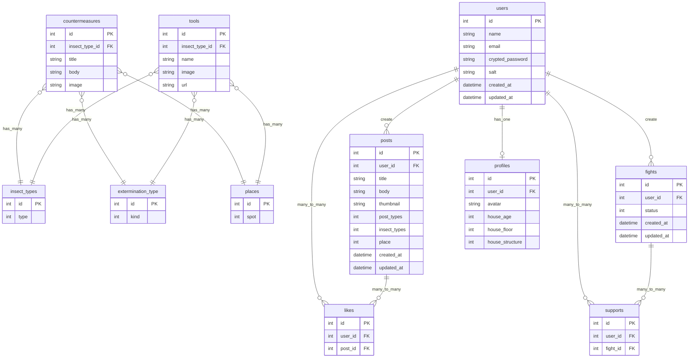

# Goki.net

## サービス概要

このアプリは、虫嫌いの方々に適切な害虫予防方法を提供し、「虫を家の中で見たくない」という課題を解決します。また、予防方法のシェア機能や、リアルタイム害虫退治機能を使用することによって「一人で虫を退治するのは心細い」という課題も解決します。

## メインのターゲットユーザー

- 害虫対策をしたいが、何から始めれば良いかわからない方。
- 害虫が出たらパニックになってくスムーズに駆除ができない方。

## ユーザーが抱える課題

- 害虫対策をインターネットで調べるが、情報が錯綜していてどのような対策が適切なのかわからない。
- 一人で害虫と対峙するのは怖い。

## 主な機能

- 一般ユーザー
  - ユーザー登録機能
  - ログイン、ゲストログイン機能
  - トップページ(サービス紹介ページ)閲覧
  - プライバシーポリシー、お問い合わせ、利用規約の閲覧
- ゲスト、ログインユーザー
  - ログイン、ログアウト機能 -リアルタイム退治中機能
    - 退治を開始できる
    - 退治を終了できる
    - 他ユーザーの退治中に「応援」（いいね）できる
    - 他ユーザーが退治を開始すると、リアルタイムで通知を受信できる
  - 害虫対策投稿機能
    - タイトルを登録、閲覧、編集、削除できる
    - 本文を登録、閲覧、編集、削除できる
    - 写真、画像を登録、閲覧、編集、削除できる
    - 「駆除」か「予防登録」をステータスとして登録、閲覧、編集、削除できる
    - 害虫の種類をステータスとして登録、閲覧、編集、削除できる
    - 対策の場所（風呂、トイレなど）をステータスとして登録、閲覧、編集、削除できる
    - いいねができる
    - キーワード検索できる
    - 築年数、家の階数、家の構造（木造、簡易鉄骨、鉄筋コンクリート）で絞り込み検索できる
    - 対策の種類（予防、駆除）で絞り込み検索できる
    - 害虫の種類で絞り込み検索できる
    - 対策の場所（風呂、トイレなど）で絞り込み検索できる
  - プロフィール機能
    - 家屋の条件を登録、編集、削除できる
      - 築年数の登録、編集、削除ができる
      - 階数の登録、編集、削除ができる
      - 木造 or 鉄筋コンクリートを登録、編集、削除できる
    - ユーザーのアバターを登録、編集、削除できる
    - ユーザーの名前を編集できる
  - おすすめ対策グッズ閲覧機能
    - RakutenAPI を使用したお勧め害虫対策グッズを閲覧できる
  - 害虫対策診断機能
  - ユーザーは診断アプリでおすすめの対策を診断できる
  - ユーザーは診断アプリでおすすめの対策グッズを診断できる

## 使用技術

- Ruby 3.0.2
- Rails 7.0.4.3
- javascript
- React 18.2.0
- PostgreSQL
- turbo-rails
- Tailwind CSS
- daisyUI
- RakutenAPI
- Render.com

## 画面遷移図

Figma: https://www.figma.com/file/JpAWH1FYorwIhAAy87n7l4/Goki.net?node-id=0%3A1&t=zhS7NEvNysyKEKCO-1

## ER 図

## なぜこのサービスを作りたいのか？

ひとり暮らしの害虫対策は孤独で辛いものです。一人で害虫を退治するのはとても怖いと思います。しかし私は、誰かと一緒にいたり、同じく害虫と戦っている人がいると、少し恐怖が和らぎ、いつもより強気になれます。このような経験から、このサービスを考えました。

## スケジュール

企画〜技術調査：5/1 〆切 
README〜ER 図作成：5/1 〆切 
メイン機能実装：5/10 - 5/30 
MVP リリース：6/1 〆切 
本番リリース：6/30 〆切 
