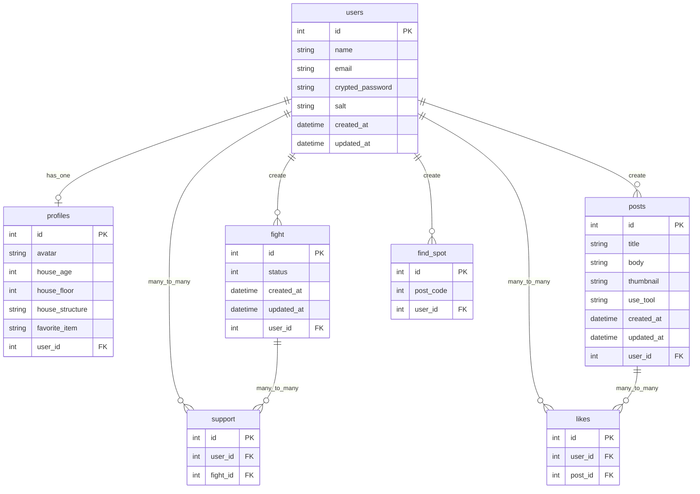

# Goki.net

## サービス概要

ゴキブリが嫌いで、ゴキブリを見たくない人やスムーズに駆除したい人たちが、互いにゴキブリ対策を共有し合い、支え合う、ゴキブリ対策対策アプリです。

## メインのターゲットユーザー

- ゴキブリ対策をしたいが、何から始めれば良いかわからない方。
- ゴキブリが出たらパニックになってくスムーズに駆除ができない方。

## ユーザーが抱える課題

- ゴキブリ対策をインターネットで調べるが、情報が錯綜していてどのような対策が適切なのかわからない。
- 一人でゴキブリと対峙するのは怖い。

## 実装予定の機能

### (MVP リリース)

- ゲストユーザー

  - ユーザー登録機能
  - トップページ(サービス紹介ページ)閲覧
  - 「退治中」切り替え機能
  - 退治中ユーザー（リアルタイム）閲覧機能
    - 退治中ユーザーへの応援（いいね）機能
  - ゴキブリ対策一覧ページ閲覧
    - 検索機能（家屋の条件、地域、駆除 or 予防）
  - 他ユーザーのゴキブリ対策詳細の閲覧機能
  - プライバシーポリシー、お問い合わせ、利用規約の閲覧

- ログインユーザー
  - ゲストユーザーの機能が全て使える
  - ログイン、ログアウト機能
  - ゴキブリ対策投稿機能
    - 写真、動画を登録、編集、削除できる
    - 駆除 or 予防を登録、編集、削除できる
  - マイページを閲覧できる
    - 家屋の条件を登録、編集、削除できる
      - 築年数の登録、編集、削除ができる
      - 階数の登録、編集、削除ができる
      - 木造 or 鉄筋コンクリートを登録、編集、削除できる
    - ゴキブリの出現、駆除を記録できる
    - お気に入りの駆除グッズ、予防グッズを登録できる
  - 他のユーザー詳細の閲覧
  - 他ユーザーの対策投稿をブックマークできる

### (本リリース)

- 追加機能
  - ゲストユーザー
    - GoogleMapAPI を使用したゴキブリ出現マップを閲覧できる

## 画面遷移図

Figma: https://www.figma.com/file/JpAWH1FYorwIhAAy87n7l4/Goki.net?node-id=0%3A1&t=zhS7NEvNysyKEKCO-1

## ER 図

## なぜこのサービスを作りたいのか？

ひとり暮らしのゴキブリ対策は孤独で辛いものです。一人でゴキブリを退治するのはとても怖いと思います。しかし私は、誰かと一緒にいたり、同じくゴキブリと戦っている人がいると、少し恐怖が和らぎ、いつもより強気になれます。このような経験から、このサービスを考えました。

## スケジュール

企画〜技術調査：5/1 〆切 
README〜ER 図作成：5/1 〆切 
メイン機能実装：6/1 - 5/10 
MVP リリース：6/1 〆切 
本番リリース：6/30 〆切 
